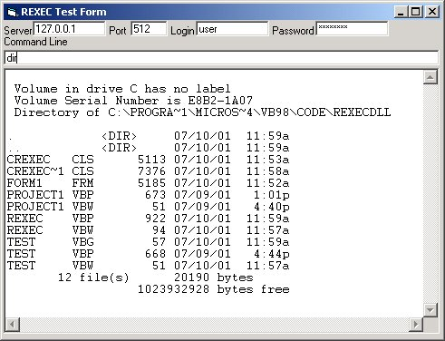



## rexec client & windows server

### Description

Many unix servers also run a rexec daemon, which lets you execute a command on the server remotely. This project provides an rexec client, and a windows server, so the same client can execute commands on both windows and unix machines. The rexec client works flawlessly for my needs when connecting to SCO Unix, Solaris, and Red Hat Linux. I imagine it will work on any unix rexec server, but I've never seen any documentation on the rexec protocol, so I couldn't say for sure.

Please note, that the windows server component is nothing special. It was a quick job I wrote this morning, and it works with the rexec client I wrote. It allows full password protected access to the command prompt of the serving machine. If there is a need for it, I'll invest some time and add better security, multiple connection support, or ability to run as an NT service, or whatever else I think of.

It stores the password in an obscured and compressed field in the registry, so it is not humanly decipherable, but it requires a trivial amount of code to retreive it. It doesn't represent any significant form of security, but it does give complete access to the command prompt once you're logged in, so BE CAREFUL WHERE YOU USE IT! Also, there may be (large) discrepancies in the real rexec protocol and my implementation of it. If anyone has documetation on it, I wouldn't mind having a look.

If you find any bugs, or have some thoughts on this, feel free to write.
 
### More Info
 
server, username, password, port, and command to send

results displayed on the command prompt

probably has a few bugs in the server. Its not been tested too much.

             |
---                |---
**Submitted On**   |2001-07-12 11:11:12
**By**             |[Alan Toews](https://github.com/Planet-Source-Code/PSCIndex/blob/master/ByAuthor/alan-toews.md)
**Level**          |Intermediate
**User Rating**    |4.6 (23 globes from 5 users)
**Compatibility**  |VB 6\.0
**Category**       |[Internet/ HTML](https://github.com/Planet-Source-Code/PSCIndex/blob/master/ByCategory/internet-html__1-34.md)
**World**          |[Visual Basic](https://github.com/Planet-Source-Code/PSCIndex/blob/master/ByWorld/visual-basic.md)
**Archive File**   |[rexec clie226447122001\.zip](https://github.com/Planet-Source-Code/alan-toews-rexec-client-windows-server__1-24882/archive/master.zip)

